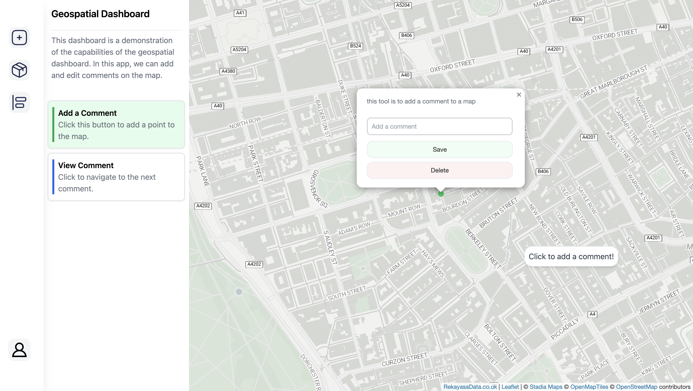

# Geospatial Dashboard: Memo App

This project showcases the development of an interactive geospatial dashboard. Within this application, users have the ability to generate, modify, and remove memos directly on the map interface. The creation of this code was significantly aided by the use of GitHub Copilot, providing an advanced collaborative coding experience.



# Leaflet for Dashboarding

[Leaflet.js](https://leafletjs.com/) is a classic javascript library to develop geospatial dashboard. This repository is a showcase of using leaflet to create that dashboard.

# Installation

git clone this project, then install with npm. Run a development server, you can use python or node. 

I use tailwind CLI to manage the CSS. So, create an ```input.css``` file, then populate with the following value:

```css
/* input.css  */
@tailwind base;
@tailwind components;
@tailwind utilities;
```

then, install.

```bash
git clone $thisRepo localDirectory
cd localDirectory
npm run i
npx tailwindcss -i ./input.css -o ./output.css --watch
python -m http.server
```